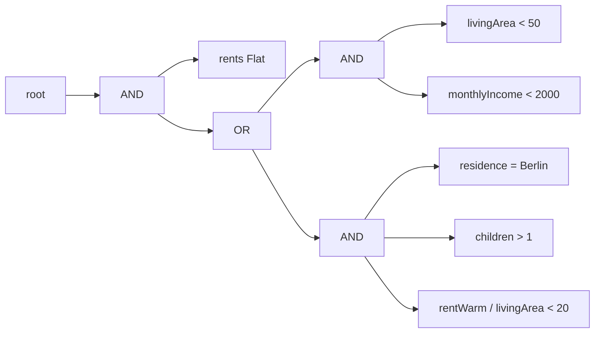

```mermaid
graph LR;
  root --> AND;
  AND --> F[rents Flat]
  AND --> OR
  OR --> AND1[AND];
  OR --> AND2[AND];
  AND1 --> LA[livingArea < 50];
  AND1 --> MI[monthlyIncome < 2000];
  AND2 --> R[residence = Berlin];
  AND2 --> C[children > 1];
  AND2 --> RL[rentWarm / livingArea < 20];
```
